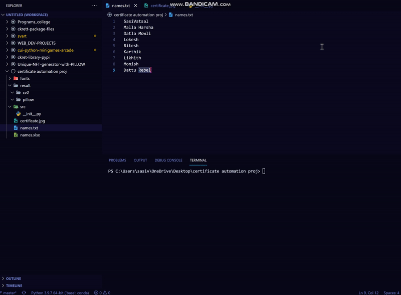
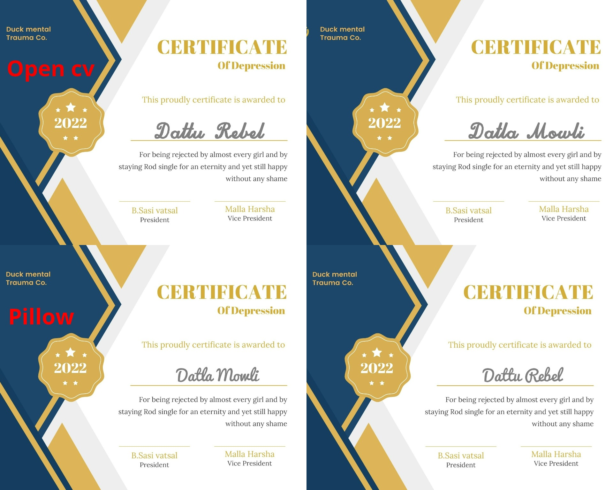

<h1 align="center">Automated Certificate Generator 📜</h1>
<h2 align="center">version-1.0.0</h2>
This repo contains my 2nd mini project that i've done while learning open CV and PILLOW modules in python.

<br />Idea for this project striked me when i attended an online webinar hosted for more than 500+ participants for skill development,
at the end of the webinar everyone is awarded with a participation certificate. I wondered how did they managed to create 500+ certificates in less than an hr.
When i was learning open CV i understood certificate automation  can be easily implemented with built-in functions in cv module, but the problem is Open CV offers very little choice of fonts,there is no option to import or use other fonts.
### In OpenCV, we have the following 8 fonts available,
-> Hershey Simplex\
-> Hershey Plain\
-> Hershey Duplex\
-> Hershey Complex\
-> Hershey Triplex\
-> Hershey Complex Small\
-> Hershey Script Simplex\
-> Hershey Script Complex

So i started to think of an alternative then i remembered PILLOW module which i learnt earlier before Open CV and made <a href='https://github.com/sasivatsal7122/Unique-NFT-generator-with-PILLOW'>NFT project</a> , in which any font can be used regardlessly.

So i decided to make a script which uses both Open CV and Pillow to gen certificates, user can choose between any of them by commenting the other in main function.
```python
if __name__=="__main__":
    clean()
    name_ls=open_textfile()
    pillow(name_ls)
    cv_2(name_ls)
```
<b>open_textfile()</b> is used to read data from names.txt (don't forget to update names.txt with you're data before running script)
<br/>Here in this example i used <b>Pacifio</b> and <b>Sofia-regular</b> , u can find many fonts and can download for free from <a href='https://www.fontsquirrel.com/fonts/list/popular'>Fontsquirrel</a>

## note: certificates made using Open cv are stored inside cv2 dir, same applies for PILLOW

# Demo:
Intially if there are any certificates in pillow or cv2 dir are cleared/deleted then updated with new certificates, u can see the log of which certificate is generated in terminal (ik resolution is f'ed up)
<p align="center"></p>

### clean() demo:
```python
def clean():
       x=input("enter folder name to clean: ")
       print("Cleaning {} folder ........".format(str(x)))
       for certificates in os.listdir("result/{}/".format(str(x))):
        os.remove("result/{}/{}".format(str(x),certificates))
       print("completed.......")
```
Just in case u forgot to delete previous certificates, clean is used to remove any previous remains.\
enter name of the folder u wanted to delete certificates in and hit enter they are deleted in a snap.
<hr style="border:10px solid grey"> </hr>

## That being said here is a quick sample created using Open CV and Pillow with Pacifico and FONT_HERSHEY_SCRIPT_COMPLEX fonts
<p align="center"></p>
<p align="center">(found this beautiful certificate template in <a href='https://www.canva.com/design/play?type=TACTmE1fsnQ&template=EAExdwsjPiw&category=tACZCk6N0I4&schema=web-2&locale=en'>Canva</a>)</p>

### In either techniques u can adjust font-weight,thickness,font-size,font-color by changing values in their respective arguments

# Note:
- As of now (1.0.0) input can only given by .txt file format, tried using pandas and xlrd for reading .csv nd .xlsx files but it didn't work out as intended.
- No other issues, everything works fine
- place you're certificate template with name strictly "certificate.jpg", update the co-ordinates for text placement, update names.txt -- # hit run and chillax! 
### - Under GPL-3.0 license you are eligible to use the code how ever you want, but do not copy paste this as you're work/project anywhere , if done so it leads to copyright violation,you can avoid it by giving credit to me by linking this repo.

(ngl open CV, Pillow are dope af🔥!)
